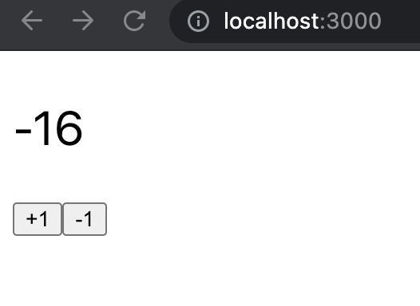

# Basic Dockerized Backend-Frontend App

A simple counter app:

- A Redis stores only one number (with `count` as key).
- A FastAPI backend server exposes two APIs -- one for retrieving the number and one for incrementing the number.
- A React frontend displays the number and two buttons for increasing & decreasing the number by calling the backend API.



## Dependenies

One must have docker & docker-compose installed to run this app.

## Launch the App

Simply run the command

```bash
docker-compose up
```

then you can access:

- frontend: `localhost:3000`
- API doc: `localhost:8080/docs`
